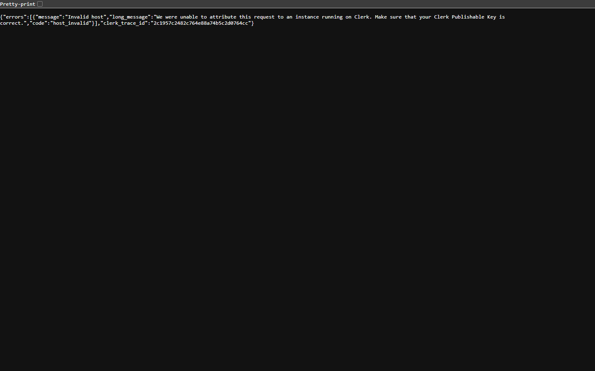
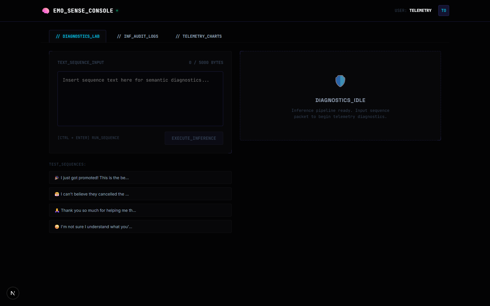
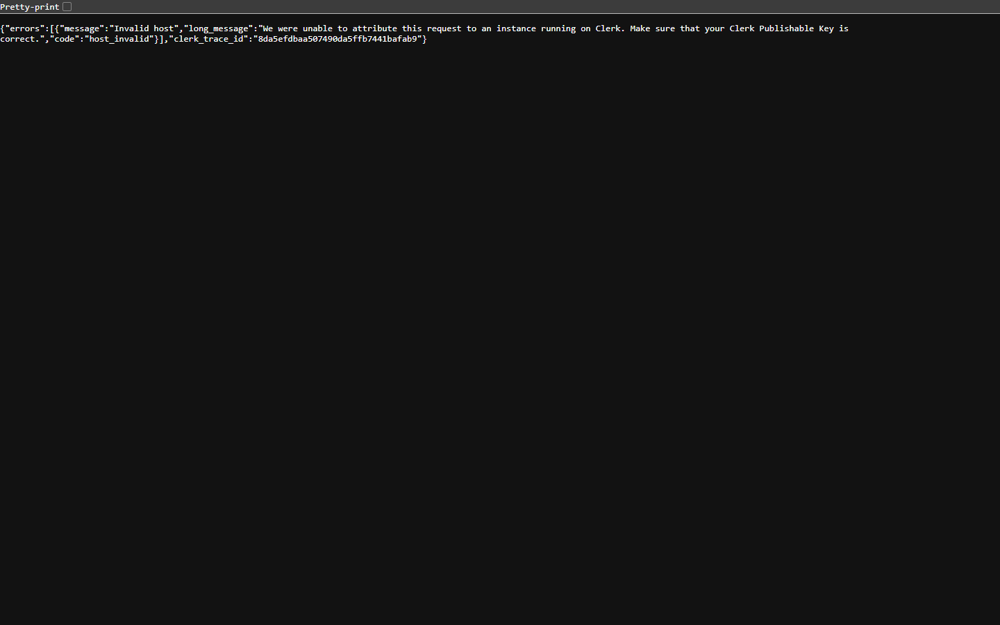

# 🧠 EmoSense: Advanced NLP Telemetry Suite & MLOps Console

<div align="center">

**A Premium Space-Black Cyberpunk Observability Hub for Deep Text Diagnostics & MLOps Lifecycle**

[](https://python.org)
[](https://pytorch.org)
[](https://nextjs.org)
[](https://neon.tech)
[](https://fastapi.tiangolo.com)

</div>

---

## 📺 Dashboard Telemetry Preview

<div align="center">
  <h3>✨ Space-Black Cyberpunk Landing Page</h3>
  
  
  <br/><br/>
  
  <h3>📈 System Telemetry Dashboard</h3>
  
  
  <br/><br/>

  <h3>💻 Phosphor Retraining & Model Tuning Lab</h3>
  
</div>

---

## 📋 Overview

**EmoSense** transitions text classification from basic positive/negative polarity into a **multi-dimensional semantic diagnostic suite**. Powered by a fine-tuned **DistilBERT** model (66M parameters) trained on Google’s **GoEmotions** dataset, EmoSense detects **27 fine-grained emotions** with millisecond-level latency. 

Beyond core emotion classification, the platform features a complete suite of NLP diagnostics (Sentiment, Toxicity, Summarization, NER, Aspect-Based Emotion, Keyphrase extraction, and Cognitive Bias scanning) built inside a **premium space-black cyberpunk web console** utilizing CSS scanline overlays, neon glows, and custom SVG analytics graphs.

---

## ⚡ Key Capabilities & Workspaces

The EmoSense dashboard provides **8 specialized workspaces** for thorough text diagnostics:

1. **Fine-Grained Emotion Lab**: Categorizes inputs across 27 distinct emotions (e.g. *admiration*, *grief*, *curiosity*, *optimism*, *fear*) with confidence rankings.
2. **Polarity Console**: Simple positive, negative, and neutral sentiment indexing.
3. **Toxicity Content Scan**: Moderation scanner identifying hate speech, insults, threats, obscene segments, and overall toxicity scores.
4. **Extractive Summarizer**: Condenses long-form prose down to its core semantic highlights.
5. **Named Entity Extractor (NER)**: Parses and highlights organizations, people, locations, and system components.
6. **Aspect-Based Emotion Scanner**: Maps local emotion scores directly to specific subjects (e.g., UI components, database operations, or performance metrics).
7. **Keyphrase Extractor**: Extracts high-relevance terms sorted by token-frequency weightings.
8. **Cognitive Bias Scanner**: Analyzes text for psychological cognitive distortions (e.g., *Catastrophizing*, *Black-and-White Thinking*, *Overgeneralization*) and highlights the exact matching phrases.

---

## 🛡️ Enterprise Security & MLOps Safeguards

EmoSense is built with strict production security safeguards and detailed MLOps monitoring layers:

* **PII Redaction Filter**: An automatic pre-processing layer that filters all text inputs to redact Emails, Phone Numbers, and Credit Card details *before* running classification or saving to databases.
* **Sliding-Window Rate Limiting**: REST endpoints are guarded by an in-memory sliding-window rate limiter restricting developers to **60 requests/minute per API Key** with clean `HTTP 429` responses.
* **Operator Session Gateways**: The operator console features password security verification, wrong password blocks, and an account recovery console that simulates sending 6-digit OTP verification codes via Email or SMS.
* **Neon PostgreSQL Traffic Audit**: Live developer traffic logs are written to Neon PostgreSQL databases and local telemetry files, tracking latency, status codes, and remote IP addresses.
* **Active Learning Retraining Terminal**: Submit incorrect predictions to the retraining backlog. Operators can run retraining triggers which stream live logs from the backend via Server-Sent Events (SSE) into a phosphor-green CRT terminal.

---

## 🏗️ Project Architecture

```
emosense/
├── .gitignore               # Excludes secrets (.env.local) and huge model weight dirs
├── README.md                # Root project documentation
├── start.bat                # Windows automation script to boot backend & frontend
├── ml/                      # Machine Learning Core Pipeline
│   ├── requirements.txt     # Python pinned dependencies
│   ├── data/load_data.py    # Downloads/pre-processes GoEmotions from HuggingFace
│   ├── baseline/            # TF-IDF + LogReg baseline classifier
│   ├── models/              # DistilBERT configuration & fine-tuning logic
│   ├── evaluate/            # Evaluation scripts, confusion matrix generator
│   ├── serve/api.py         # FastAPI REST service
│   ├── train.py             # CLI orchestrator for pipeline stages
│   ├── predict.py           # CLI prediction script
│   └── model_card.md        # DistilBERT model training metrics
│
└── web/                     # Next.js Cyberpunk Web Application
    ├── app/                 # Next.js App Router (Console workspaces, Auth page, API routes)
    ├── components/          # Reusable UI widgets (Navbar, Sidebar, Footer)
    ├── lib/                 # Neon PostgreSQL schema helper and mock classifiers
    └── public/              # Global SVG assets and showcase screenshots
```

---

## 🚀 Quick Start

### 1. ML Backend Service Setup
Prerequisite: Python 3.10+ installed. A CUDA-compatible GPU is recommended for model training.

```bash
cd ml
pip install -r requirements.txt

# Run full pipeline: Load Data -> Train Baseline -> Fine-tune DistilBERT -> Evaluate
python train.py --epochs 4 --batch_size 32

# Verify CLI predictions
python predict.py --text "I am absolutely thrilled about this release!"

# Start the FastAPI serving endpoint
uvicorn serve.api:app --host 0.0.0.0 --port 8000
```

### 2. Next.js Web Console Setup
Prerequisite: Node.js 18+ installed.

```bash
cd web
npm install

# Set up local environment settings
cp .env.local.example .env.local

# Edit .env.local to include your Neon PostgreSQL connection string and Clerk settings
# If Clerk keys are empty, EmoSense defaults to its secure built-in Mock Authentication Operator database.

npm run dev
```

### 3. Unified Startup (Windows)
You can launch both the FastAPI backend and the Next.js development server concurrently with a single command from the project root:
```bash
.\start.bat
```
Then visit **http://localhost:3000** in your browser to access the EmoSense Operators Console.

---

## 🏷️ Fine-Grained Emotion Map (27 GoEmotions Classes)

| ID | Emotion Class | ID | Emotion Class | ID | Emotion Class |
|----|---------------|----|---------------|----|---------------|
| **0** | admiration | **9** | disapproval | **18** | nervousness |
| **1** | amusement | **10** | disgust | **19** | optimism |
| **2** | anger | **11** | embarrassment | **20** | pride |
| **3** | annoyance | **12** | excitement | **21** | realization |
| **4** | approval | **13** | fear | **22** | relief |
| **5** | caring | **14** | gratitude | **23** | remorse |
| **6** | confusion | **15** | grief | **24** | sadness |
| **7** | curiosity | **16** | joy | **25** | surprise |
| **8** | desire | **17** | love | **26** | neutral |

---

## 🛡️ License & Attributions

* **Dataset License**: Google GoEmotions is licensed under the Apache License 2.0.
* **Scope**: Designed for portfolio, educational, and developer demonstration use cases.

<div align="center">
  <sub>Built by <strong>Aaditya Uniyal</strong> · Amazon ML School Showcase Project</sub>
</div>
